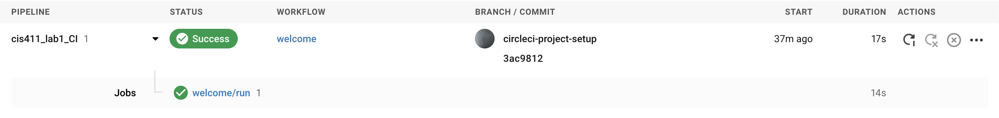

# Lab Report: Continuous Integration
___
**Course:** CIS 411, Spring 2021  
**Instructor(s):** [Trevor Bunch](https://github.com/trevordbunch)  
**Name:** Wesley Cheah
**GitHub Handle:** [wesleyyycheah](https://github.com/wesleyyycheah)
**Repository:** [Forked Repository](https://github.com/wesleyyycheah/cis411_lab1_CI)
___

# Step 1: Fork this repository
- The URL of my forked repository: [LAB_1_fork](https://github.com/wesleyyycheah/cis411_lab1_CI)
- The accompanying diagram of what my fork precisely and conceptually represents:


# Step 2: Clone your forked repository from the command line  
- My local file directory is: Downloads/GitHub/cis411_lab1_CI
- The command to navigate to the directory when I open up the command line is: cd Downloads/GitHub/cis411_lab1_CI

# Step 3: Run the application locally
- My GraphQL response from adding myself as an account on the test project
``` json
{
  "data": {
    "mutateAccount": {
      "id": "48cf9978-af7b-4030-ad3c-314e087ad73d",
      "name": "Wesley Cheah",
      "email": "wesleycheah1997@gmail.com"
    }
  }
}
```

# Step 4: Creating a feature branch
- The output of my git commit log
```
[labreport fa675d0] my commit to the @trevorbunch repo
 1 file changed, 79 insertions(+)
 create mode 100644 labreports/lab1_report.md
```
- The accompanying diagram of what my feature branch precisely and conceptually represents


# Step 5: Setup a Continuous Integration configuration
- What is the .circleci/config.yml doing?  
I'm not 100% sure what it does... however, if I were to guess, it is to automate testing of the software that is being integrated continuously. This is just a simple automated testing file.

- What do the various sections on the config file do?  
1. For the Docker section, you state the version of Node that you want to use. You also specify the directory you want to work on.
2. As for steps, this is where the automated testing is done.

- When a CI build is successful, what does that philosophically and practically/precisely indicate about the build?  
When a CI build is successful, it means that the repo that was just set up is ready for CI/CD development. 

- If you were to take the next step and ready this project for Continuous Delivery, what additional changes might you make in this configuration (conceptual, not code)?  
More complicated testing.


# Step 6: Merging the feature branch
* The output of my git commit log
```
Trevors-MBP:cis411_lab0 trevorbunch$ git log --oneline
dbf826a (HEAD -> labreport, origin/labreport) Answer Step 4
a9c1de6 Complete Step 1, 2 and 3 of LAB_TREVORDBUNCH
1ead543 remove LAB.md
8c38613 Initial commit of labreport with @tangollama
dabceca (upstream/main, origin/main, origin/HEAD, main) Merge pull request #24 from tangollama/circleci
a4096db Create README.md
...
44ce6ae Initial commit
(END)
```

* A screenshot of the _Jobs_ list in CircleCI


# Step 7: Submitting a Pull Request
_Remember to reference at least one other student in the PR content via their GitHub handle._

# Step 8: [EXTRA CREDIT] Augment the core project
PR reference in the report to one of the following:
1. Add one or more unit tests to the core assignment project. 
2. Configure the CircleCI config.yml to automatically build a Docker image of the project.
3. Configure an automatic deployment of the successful CircleCI build to an Amazon EC2 instance.